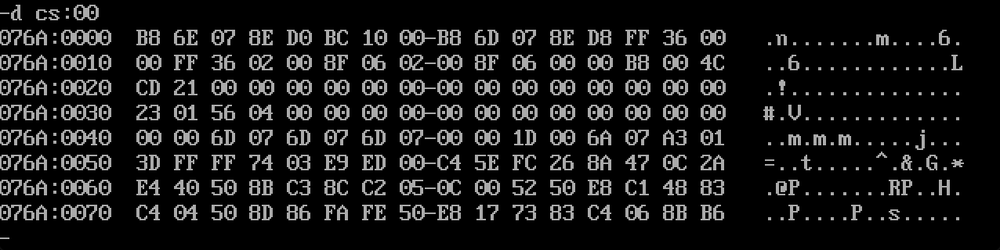

# t1

1）0123h, 0456h, 0789h, 0abch, 0fedh, 0cbah, 0987h
we need to find this mem use instructure d ds:100, because 程序最开始时 ds:00~ds:100H 是留给程序与操作系统通讯使用的 psp内存段

2) 076C, 076B, 076A

3) X-2,X-1 (Let's think about this, the physical addr is 16 * CS + IP, then if I make the 2 * 8 = 16 
bit be the mem, then the difference of 段地址 is 1)

# t2
1) 23 01 56 04 00 00 ......... 00

2)076c, 076b, 076a

3)X-2, X-1

4) ((N / 16)  + 1) * 16

# t3

1)the pic1 is so clear that we can see cs:0000 ~ cs:0020 is the code segment, and the [cs:0030,cs:0040) is the data segment, the next line is the stack segment.

2) cs = 076a, ss = 076e, ds = 076d

3) X+3, X+4

# t4

t3 can run correctly,  because the code segment is the head, so we can run this at the beginning.

# t5
answer in the t5.asm 

use al not ax when add operator, because I use db to store number.

# t6

answer in the t6.asm

